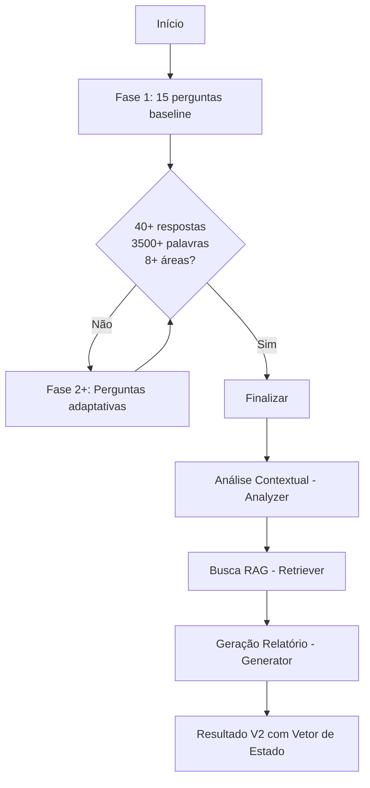

# Documentação NARA - Diagnóstico de Transformação Narrativa

> **Metodologia:** Phellipe Oliveira  
> **Versão da API:** 2.0  
> **Última atualização:** Fevereiro 2026

---

## 📚 Índice de Documentos

### Para Desenvolvedores

1. **[API_V2_DOCUMENTATION.md](./API_V2_DOCUMENTATION.md)**  
   Documentação técnica completa da API V2, incluindo todos os novos campos (Vetor de Estado, Memórias Vermelhas, Âncoras Práticas) e schemas completos.

2. **[INTEGRATION_GUIDE.md](./INTEGRATION_GUIDE.md)**  
   Guia prático de integração com exemplos de código, componentes React, gerenciamento de estado e testes.

### Para Product Owners / Gestores

3. **[../documentos/01_BASE_METODOLOGICA_NARA.md](../documentos/01_BASE_METODOLOGICA_NARA.md)**  
   Base conceitual completa da metodologia: 12 Áreas, 4 Motores, 6 Clusters de Crise, 19 Âncoras Práticas.

4. **[../documentos/04_BACKEND_API.md](../documentos/04_BACKEND_API.md)**  
   Especificação técnica do backend (FastAPI + LangChain + RAG).

5. **[../documentos/05_FRONTEND_UX.md](../documentos/05_FRONTEND_UX.md)**  
   Especificação do frontend (React + Vite + Zustand + TailwindCSS).

---

## 🎯 Quick Links

### Endpoints Principais

| Endpoint | Método | Descrição |
|----------|--------|-----------|
| `/api/v1/diagnostic/start` | POST | Inicia novo diagnóstico |
| `/api/v1/diagnostic/{id}/answer` | POST | Submete resposta |
| `/api/v1/diagnostic/{id}/eligibility` | GET | Verifica se pode finalizar |
| `/api/v1/diagnostic/{id}/next-questions` | POST | Gera próxima fase |
| `/api/v1/diagnostic/{id}/finish` | POST | Finaliza e gera resultado |
| `/api/v1/diagnostic/result/{token}` | GET | Acessa resultado por token |

### Estruturas Principais V2

```typescript
// Vetor de Estado (núcleo do diagnóstico V2)
interface VetorEstado {
  motor_dominante: string;        // Necessidade|Valor|Desejo|Propósito
  estagio_jornada: string;        // Germinar|Enraizar|...|Realizar
  crise_raiz: string;             // 6 clusters possíveis
  necessidade_atual: string;      // Call-to-action principal
  // + 6 campos adicionais
}

// Novos campos do resultado
memorias_vermelhas: string[];     // Citações do usuário
ancoras_sugeridas: string[];      // Das 19 âncoras práticas
areas_silenciadas: number[];      // Áreas evitadas (1-12)
```

---

## 🚀 Começando

### 1. Clone o repositório
```bash
git clone https://github.com/your-org/naraproject.git
cd naraproject
```

### 2. Backend (FastAPI)
```bash
cd nara-backend
python3.12 -m venv .venv
source .venv/bin/activate
pip install -r requirements.txt

# Configurar .env
cp .env.example .env
# Editar .env com suas chaves (Supabase, OpenAI)

# Rodar
uvicorn app.main:app --reload
```

### 3. Frontend (React + Vite)
```bash
cd nara-frontend
npm install

# Configurar .env
cp .env.example .env
# Editar VITE_API_URL se necessário

# Rodar
npm run dev
```

### 4. Testar
```
Backend: http://localhost:8000/docs
Frontend: http://localhost:5173
```

---

## 📊 Fluxo do Diagnóstico



---

## 🔑 Conceitos-Chave da Metodologia

### 4 Motores Motivacionais
- **Necessidade:** Afastar-se da dor
- **Valor:** Integridade e coerência
- **Desejo:** Conquista e realização
- **Propósito:** Legado e impacto

### 6 Fases da Jornada
1. **Germinar** - Despertar inicial
2. **Enraizar** - Busca de fundamentos
3. **Desenvolver** - Construção ativa
4. **Florescer** - Expressão autêntica
5. **Frutificar** - Resultados tangíveis
6. **Realizar** - Plenitude e maestria

### 6 Clusters de Crise (M1)
1. **Identidade Raiz** - "Quem eu sou"
2. **Sentido e Direção** - "Para onde vou"
3. **Execução e Estrutura** - "Como faço"
4. **Conexão e Expressão** - "Como me relaciono"
5. **Incongruência Identidade-Cultura** - "Não pertenço"
6. **Transformação de Personagem** - "Medo de mudar"

### 19 Âncoras Práticas
Ações concretas para encarnar nova identidade:
- **Ambiente:** Referências, Objetos, Ambientes, Grupo
- **Comunicação:** Tom, Vocabulário, Postura, Vestimenta
- **Rotina:** Rituais Matinais/Noturnos, Limites, Marcos
- **Emoção:** Emoção Projetada, Gestão de Energia, Práticas de Recarga
- **Ação:** Tarefas Identitárias, Microentregas, Exposição Gradual, Testemunhas

---

## 🛠️ Stack Tecnológico

### Backend
- **Framework:** FastAPI 0.109+
- **LLM:** OpenAI GPT-4
- **Embeddings:** OpenAI text-embedding-3-small
- **Vector DB:** Supabase (PostgreSQL + pgvector)
- **RAG:** LangChain + Custom Retriever

### Frontend
- **Framework:** React 18 + TypeScript
- **Build:** Vite 5
- **Routing:** React Router 6
- **State:** Zustand + React Query
- **UI:** TailwindCSS + shadcn/ui
- **Forms:** React Hook Form + Zod

### Infra
- **Backend Deploy:** Render
- **Frontend Deploy:** Vercel
- **Database:** Supabase (hosted PostgreSQL)
- **Monitoring:** (a definir)

---

## 📈 Métricas e Analytics

### Métricas de Diagnóstico
- Total de diagnósticos iniciados
- Taxa de conclusão (início → finalização)
- Tempo médio de conclusão
- Palavras médias por resposta
- Distribuição de motores dominantes
- Distribuição de clusters de crise

### Métricas de Qualidade
- Respostas com < 30 palavras (flag de qualidade baixa)
- Áreas silenciadas mais comuns
- Taxa de elegibilidade atingida por fase

---

## 🤝 Contribuindo

1. Fork o repositório
2. Crie uma branch: `git checkout -b feature/nova-funcionalidade`
3. Commit suas mudanças: `git commit -m 'feat: adiciona nova funcionalidade'`
4. Push para a branch: `git push origin feature/nova-funcionalidade`
5. Abra um Pull Request

### Padrões de Commit
- `feat:` Nova funcionalidade
- `fix:` Correção de bug
- `docs:` Documentação
- `refactor:` Refatoração de código
- `test:` Testes
- `chore:` Tarefas de manutenção

---

## 📞 Suporte

- **Email:** dev@naraproject.com
- **Documentação:** https://docs.naraproject.com
- **Issues:** https://github.com/your-org/naraproject/issues

---

## 📄 Licença

Copyright © 2026 Phellipe Oliveira - Todos os direitos reservados.

**Metodologia NARA** é propriedade intelectual de Phellipe Oliveira.

---

**Versão:** 2.0.0  
**Status:** Produção  
**Mantenedor:** Time NARA
